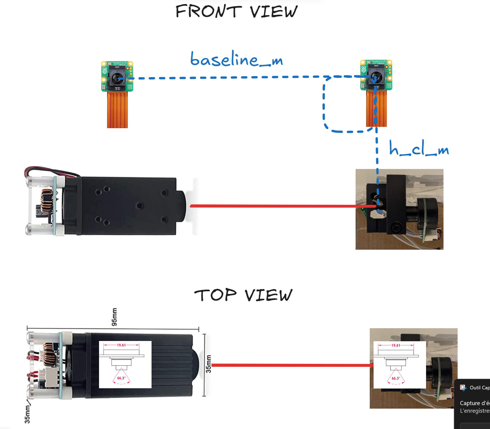
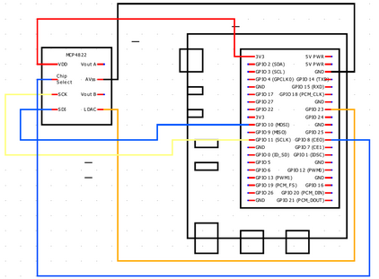
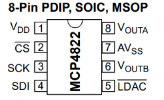
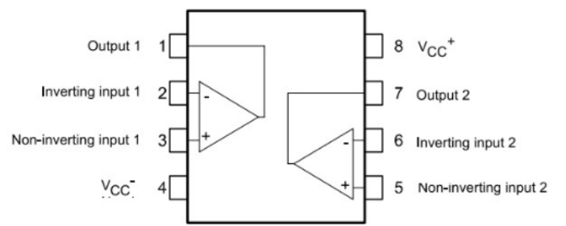
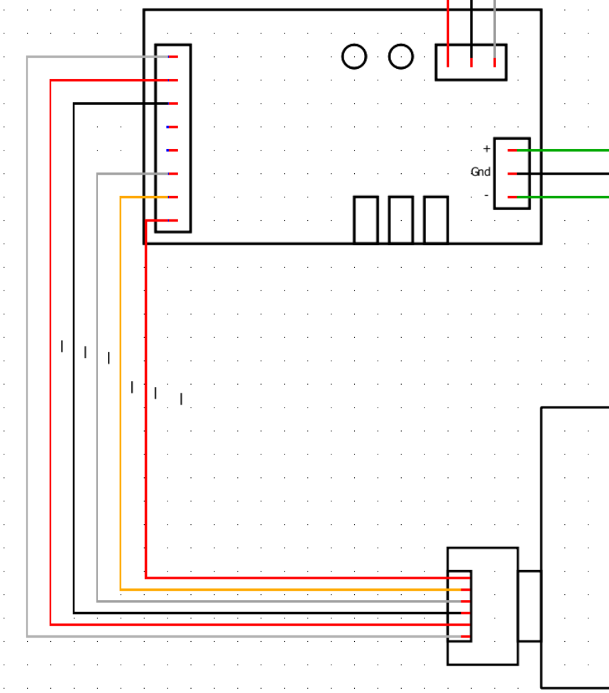

# 🐝 Projet Cap 5A — Protection de ruches contre les frelons par laser automatisé

## Objectif

Les frelons asiatiques se positionnent à l’entrée des ruches, empêchant les abeilles de sortir et entraînant leur épuisement et leur mort.
Ce projet vise à **détecter automatiquement les frelons** à l’aide d’une IA embarquée et à les **repousser avec un laser piloté par galvos**, afin de protéger les ruches.

## Architecture globale
 - IA
    entrainrer le modèle pour reconnaitre le frelon
 - Rasbery
    code récuprer infot caméra calcule angle galvo et alume le laser

## Liste du matériel

- Raspberry Pi 5 — 8 Go ×1
- Alimentation pour Raspberry Pi 5 ×1
- Ventilateur actif pour Raspberry Pi 5 ×1
- Raspberry Pi AI Camera (Sony IMX500) ×2
- Module galvo laser ×1  
  Produit : https://www.amazon.fr/dp/B0C7VLWXV3
- Alimentation pour module galvo ×1
- Laser (dangereux) ×1
- Boîtier ×1
- 2x AOP TL082 
- 1x DAC MCP4288 

## Conditions de montage et d’alignement

Pour un fonctionnement optimal :

- Les caméras et la sortie du galvanomètre doivent être alignées en profondeur.
- Le galvanomètre doit être positionné sous la caméra gauche.
- Le système de visée est basé sur la caméra gauche, qui doit être parfaitement alignée avec la sortie des miroirs.
- Distance entre les centres optiques des deux caméras (`baseline_m`) : ex : 10 cm.
- Les deux caméras doivent être strictement parallèles.

### Paramètres de configuration

Les variables suivantes sont modifiables dans le fichier de configuration :

- `baseline_m` = 10 cm (par défaut)
- `h_cl_m` = 9.5 cm (par défaut)

### Schéma



---

## Installation du projet

### Entraînement de l’IA
nous avons déjà entrainter un modèle yolo11n avec notre propre dataset, il se trouce ici IA/best.py

#### Étapes

1. Créer un dataset (frelon / abeille / fond)
2. Fine-tuning du modèle
3. Export compatible IMX500
4. Conversion au format requis par la NPU
5. Déploiement sur la Raspberry

detailler dans [[IA/README.md]]


### 1. Installation du système d’exploitation

il faut maitre le systemte d'exploitation de la rasbery sur un carte sd (min 16go) pour cela nous allons utiliser la facher officher rasbery

#### 1.1 Télécharger Raspberry Pi Imager

Télécharger l’outil officiel ici :
[https://www.raspberrypi.com/software/](https://www.raspberrypi.com/software/)

Installer Raspberry Pi Imager sur votre ordinateur (Windows / Mac / Linux).

#### 1.2 Choix du système

1. Ouvrir **Raspberry Pi Imager**
2. Cliquer sur **Choose OS**
3. Aller dans :
   * Raspberry Pi OS (other)
   * Puis sélectionner :
     **Raspberry Pi OS (Legacy) Lite 64bit**

⚠️ Ce choix est important car cette version contient Python 3.11 natif, nécessaire pour le projet.

#### 1.3 Choix de la carte SD

1. Cliquer sur **Choose Storage**
2. Sélectionner votre carte SD

#### 1.4 Paramètres avancés (IMPORTANT)

Avant de flasher, cliquer sur l’icône ⚙️ (roue dentée) et configurer :
✅ Activer SSH
✅ Définir un nom d’utilisateur et mot de passe
✅ Configurer le Wi-Fi
✅ Régler le fuseau horaire

Cela permet de se connecter à la Raspberry sans écran.

#### 1.5 Flash de la carte SD

Cliquer sur **Write** et attendre la fin de l’écriture.

### 2. Démarrage de la Raspberry Pi

1. Insérer la carte SD dans la Raspberry Pi
2. Brancher l’alimentation
3. Attendre environ 1 minute

### 3. Connexion en SSH

Depuis votre ordinateur :

#### Windows

Utiliser PowerShell ou Putty.

#### Mac / Linux

Ouvrir un terminal.

Commande :

```bash
ssh utilisateur@ip_de_la_raspberry
```

Exemple :

```bash
ssh pi@192.168.1.42
```

### 4. Mise à jour du système

Une fois connecté :

```bash
sudo apt update
sudo apt install git
```

Cela peut prendre plusieurs minutes.

### 5. Installation du projet

#### 5.1 Télécharger le projet

```bash
git clone https://github.com/janvier68/ExterminationFrelon.git
```

Puis :

```bash
cd ExterminationFrelon/Rasbery
```

#### 5.2 Création d’un environnement Python

Cela évite de casser le système.

```bash
python3 -m venv venv
```

Activation :

```bash
source venv/bin/activate
```

Après activation, vous verrez `(venv)` devant la ligne de commande.

#### 5.3 Activation automatique du venv (optionnel mais recommandé)

Éditer le fichier `.bashrc` :

```bash
nano ~/.bashrc
```

Ajouter à la fin :

```bash
source ~/ExterminationFrelon/Rasbery/venv/bin/activate
```

Sauvegarder :
CTRL + O → Entrée
Quitter :
CTRL + X

### 6. Installation des dépendances

Toujours dans le dossier `Rasbery` et avec le venv activé :

```bash
pip install -r requirements.txt
```

Cela installe :
* OpenCV
* Flask
* Librairies IMX500
* Outils mathématiques
* Etc.

### 7. Installation du modèle IA

1. Récupérer le modèle YOLO11n compatible IMX500
2. Copier le fichier dans le dossier prévu (ex : `models/`)
3. Vérifier qu’il est bien reconnu par la NPU

### 8. Setup matériel

Lancer :

```bash
python setup.py
```

Ce script va :
* Vous demander les informations sur la ruche
* Tester la caméra
* Tester le laser
* Tester les galvos
* Vérifier les connexions
* Lancer la calibration

#### Calibration caméra

Vous aurez besoin d’un damier imprimé :
`docs/Dammier.png`

Imprimer ce fichier et le placer devant la caméra pendant la calibration.

### 9. Lancement du système

#### Version avec interface web

```bash
python main.py
```

Accès via navigateur :

```
http://ip_de_la_raspberry:5000
```

#### Version sans interface (mode autonome)

```bash
python mainNoUI.py
```

---

## Explication technique
Readme.md dans chaque classe

## Sécurité

⚠️ Le laser doit être :

* Classe faible puissance
* Jamais dirigé vers les humains
* Jamais vers les abeilles
* Limité à une zone définie

Une **safe zone** en pixels est définie.


## Branchement électrique

### Objectif du système

Ce montage a pour but de piloter deux galvanomètres (axes X et Y) afin d’orienter un faisceau laser.  
La Raspberry Pi 5 génère des commandes numériques, converties en signaux analogiques par un DAC (MCP4822), puis amplifiées par des AOP (TL082) avant d’être envoyées aux drivers des galvanomètres.

L’ensemble des modules analogiques est alimenté par une alimentation bipolaire ±12 V commune.

### Interface SPI

Le SPI est un protocole de communication série synchrone permettant de relier un maître (Raspberry Pi) à un ou plusieurs esclaves (DAC) à l’aide de quelques fils.

#### Lignes SPI utilisées

| Nom  | Signification           | Direction     | Rôle                                 |
|------|-------------------------|---------------|--------------------------------------|
| MOSI | Master Out Slave In     | Pi → DAC      | Données envoyées par la Raspberry Pi |
| MISO | Master In Slave Out     | DAC → Pi      | Données renvoyées (non utilisé ici) |
| SCK  | Serial Clock            | Pi → DAC      | Horloge SPI                          |
| CS   | Chip Select             | Pi → DAC      | Sélection du périphérique            |

### Raspberry Pi 5

#### Rôle

- Contrôleur principal
- Génère les valeurs numériques envoyées au DAC via SPI
- Pilote l’allumage/extinction du laser



### DAC MCP4822

#### Description

- Convertisseur numérique–analogique double canal (12 bits)
- Deux sorties analogiques : axe X et axe Y
- Plage de sortie : 0 à 4,096 V
- Interface : SPI



#### Connexions

| Nom     | Pin connecté                | Fonction                     |
|----------|-----------------------------|------------------------------|
| VDD      | 3V3 (Pi 5)                  | Alimentation +3,3 V          |
| CS       | GPIO 8 (CE0) (Pi 5)         | Chip Select SPI              |
| SCK      | GPIO 11 (SCLK) (Pi 5)       | Horloge SPI                  |
| SDI      | GPIO 10 (MOSI) (Pi 5)       | Données SPI                  |
| LDAC     | GPIO 23 (Pi 5) ou GND       | Latch DAC                    |
| Vout A   | -IN A (TL082 X) via 10 kΩ   | Sortie analogique axe X      |
| Vout B   | -IN B (TL082 Y) via 10 kΩ   | Sortie analogique axe Y      |
| AVss     | GND (Pi 5)                  | Masse                        |

### AOP TL082

#### Description

- Double amplificateur opérationnel
- Alimentation : ±12 V
- Génère des signaux bipolaires (≈ -5 V à +5 V)
- Fonctions :
  - Canal A : mise à l’échelle du signal (0–4 V → ±5 V)
  - Canal B : inversion pour créer un signal différentiel



#### Connexions

| Nom    | Connexion                              | Fonction                                      |
|---------|---------------------------------------|-----------------------------------------------|
| OUT A   | Vers driver IN+                        | Sortie canal A                                |
|         | Vers -IN B (via 10 kΩ)                | Liaison interne                               |
|         | R feedback 24.3 kΩ vers -IN A         | Boucle de rétroaction                         |
| -IN A  | Vout A (DAC) via 10 kΩ                | Entrée inverseuse canal A                     |
| +IN A  | GND                                   | Entrée non-inverseuse canal A                 |
| V−     | −12 V                                 | Alimentation négative                         |
| +IN B  | GND                                   | Entrée non-inverseuse canal B                 |
| -IN B  | OUT A via 10 kΩ                       | Entrée inverseuse canal B                     |
| OUT B  | Vers driver IN−                       | Sortie canal B                                |
|         | R feedback 24.3 kΩ vers -IN B         | Boucle de rétroaction                         |
| V+     | +12 V                                 | Alimentation positive                         |


### Drivers des galvanomètres

#### Description

- Cartes fournies avec les galvanomètres
- Alimentées en ±12 V
- Entrées différentielles : IN+, IN−, GND
- Commande proportionnelle à la tension :
  - +5 V → déviation maximale
  - −5 V → déviation maximale opposée
  - 0 V → position centrale

#### Connexions

| Driver | Connexion          |
|--------|-------------------|
| IN +   | OUT A (TL082)     |
| IN −   | OUT B (TL082)     |
| GND    | GND alimentation  |



---

## TODO

### Logiciel

* [ ] Configuration safe zone à ajouster lors setup
* [ ] config bouton teste laser et application paramètre
* [ ] Tests :
  * setup.py (voir bouton pour laser)
  * mainNoUI.py
  * testMateriel.py

### Documentation

* [ ] Schéma du boîtier ?

## Problème possible
laser fait un rectagle, dans angle on part du postula que sa fait un carré